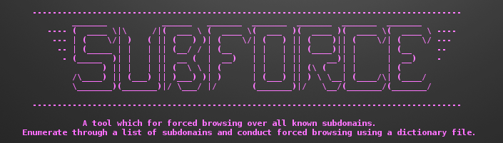

          --------------------------------------------------------------------------------------
                  _______           ______   _______  _______  _______  _______  _______
            ---- (  ____ \|\     /|(  ___ \ (  ____ \(  ___  )(  ____ )(  ____ \(  ____ \ ----
             --- | (    \/| )   ( || (   ) )| (    \/| (   ) || (    )|| (    \/| (    \/ ---
              -- | (_____ | |   | || (__/ / | (__    | |   | || (____)|| |      | (__     --
               - (_____  )| |   | ||  __ (  |  __)   | |   | ||     __)| |      |  __)    -
                       ) || |   | || (  \ \ | (      | |   | || (\ (   | |      | (
                 /\____) || (___) || )___) )| )      | (___) || ) \ \__| (____/\| (____/
                 \_______)(_______)|/ \___/ |/       (_______)|/   \__/(_______/(_______/
 
          --------------------------------------------------------------------------------------

                      A tool that enables forced browsing over all known subdomains. 
       Enumerate through a list of subdomains and conduct forced browsing using a dictionary file. 

  

Files must be in linebyline format, csv is not currently supported

usage: subforce --sublist/-s <sublist-file> --dirlist/-s <dirlist-file>
  File must be linebyline format, csv is not currently supported

optional arguments:
  -h, --help            show this help message and exit
  -s SUBLIST_FILE, --sublist SUBLIST_FILE
                        dictionary of subdomains obained with e.g. sublist3r, you can also enter subdomains directly via command params
  -d DIRLIST_FILE, --dirlist DIRLIST_FILE
                        dictionary list of sub-directories, you can also enter sub-dirs directly via command params

Sample output file: 

# Current State

v0.1:
- ingest subdomain and subdirectory files
- forced browsing across all given subdomains
- output response headers, links, scripts (stripped from response object) to results.txt file
- swaps out user agents between requests

# Currently not supported but on roadmap:
- native proxy support (for now just use proxychains please)
- database support

# Development Roadmap

v1.0:
- custom output files
- add proxy support
- csv formatted subdomain and subdir files
- custom response exclude i.e. 400, 403, Server Not Found
- better print to screen format (tabled, paged etc)
- randomized delays between requests
- dump html content to individual files in a tree structure for navigating with browser
- native open with w3m

v2.0:
- database support (mysql? sqllite? mariadb? not sure tbh, feel free to yell suggestions xx)
- prelim content discovery for use with WFUZZ
